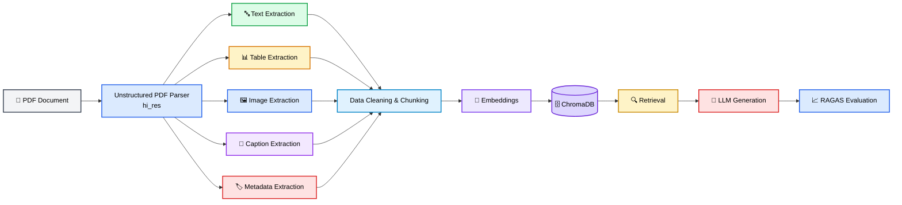

# Multimodal PDF Parsing Pipeline
## Project Architecture

## Project Architecture


A Python-based PDF parsing pipeline for extracting and structuring
**text, tables, images, captions, and metadata** from complex PDF
documents using
[Unstructured](https://github.com/Unstructured-IO/unstructured).

## Overview

The current implementation focuses on the **document ingestion and
parsing stage** of a multimodal RAG pipeline.

A PDF document is processed with Unstructured's high-resolution
(`hi_res`) strategy, allowing the pipeline to identify and extract
different document elements while preserving useful metadata

### Current Pipeline

``` text
PDF Document
     │
     ▼
Unstructured PDF Parser
     │
     ├── Text
     ├── Tables
     ├── Images
     ├── Figure Captions
     └── Metadata
     │
     ▼
Structured Parsed Output
```

## What Has Been Implemented

### 1. High-Resolution PDF Parsing

The PDF is parsed using Unstructured's `hi_res` strategy.

This is used to handle documents containing a mixture of normal text,
tables, figures, and other structured elements.

Example configuration:

``` python
raw_chunks = partition_pdf(
    filename=pdf_file_path,
    strategy="hi_res",
    infer_table_structure=True,
    extract_image_block_types=["Image", "Table"],
    extract_image_block_to_payload=True,
    chunking_strategy=None,
)
```

### 2. Text Extraction

Text elements are extracted from the parsed PDF and stored separately
for further processing.

The extracted text includes:

-   Document title
-   Abstract
-   Section headings
-   Paragraphs
-   Subsections
-   Technical content
-   Figure captions
-   Other recognized textual elements

Example:

``` python
text_data = []

for element in raw_chunks:
    if element.category == "Text":
        text_data.append(element.text)
```

### 3. Table Extraction

Tables are detected separately from normal text.

The parser is configured with:

``` python
infer_table_structure=True
```

This allows table structure to be inferred and table-related information
to be retained in the parsed output.

Tables can therefore be handled independently from normal text during
later stages of the pipeline.

### 4. Image Extraction

Images/figures embedded in the PDF are extracted as separate `Image`
elements.

The pipeline extracts image data into the element metadata, including:

-   `image_base64`
-   `image_mime_type`
-   `page_number`
-   `element_id`
-   Associated text/caption information

Example metadata fields:

``` python
{
    "image_base64": "...",
    "image_mime_type": "image/jpeg",
    "page_number": 2,
    "element_id": "..."
}
```

Base64 image data can then be decoded and passed to a vision-capable
model for image understanding.

### 5. Figure Captions

Figure captions are preserved as part of the parsed document
information.

For example, figures such as:

-   Technology tree of RAG research
-   Representative RAG process
-   Comparison between RAG paradigms
-   Retrieval augmentation processes
-   RAG ecosystem

can be associated with their corresponding document content.

### 6. Metadata Extraction

The pipeline retains useful document-level and element-level metadata.

Examples include:

``` text
page_number
filename
file_directory
element_id
category
image_mime_type
image_base64
```

This metadata will be useful later for:

-   Source attribution
-   Page-level retrieval
-   Filtering
-   Document identification
-   Multimodal retrieval
-   RAG citations

## Current Output Structure

The extracted information is organized conceptually into different
element types:

``` text
Parsed PDF
│
├── Text
│   ├── text
│   ├── page_number
│   └── element_id
│
├── Table
│   ├── text
│   ├── table structure
│   ├── page_number
│   └── element_id
│
└── Image
    ├── image_base64
    ├── image_mime_type
    ├── caption/text
    ├── page_number
    └── element_id
```

## Technologies Used

-   **Python**
-   **Unstructured**
-   **PDF parsing**
-   **High-resolution document parsing**
-   **Table structure extraction**
-   **Image extraction**
-   **Metadata extraction**
-   **Base64 image handling**

## Project Structure

A recommended repository structure is:

``` text
PDF-Parsing/
│
├── files/
│   └── .gitkeep
│
├── figures/
│   └── .gitkeep
│
├── pages/
│   └── .gitkeep
│
├── dev.ipynb
├── requirements.txt
├── README.md
├── .gitignore
└── .env
```

> **Note:** `.env` should never be committed to GitHub because it may
> contain API keys or other secrets.

## Current Status

### Completed

-   [x] PDF ingestion
-   [x] High-resolution PDF parsing
-   [x] Text extraction
-   [x] Table extraction
-   [x] Table structure inference
-   [x] Image extraction
-   [x] Image Base64 extraction
-   [x] Image MIME-type extraction
-   [x] Figure caption extraction
-   [x] Page-level metadata extraction
-   [x] Element-level metadata extraction

### Next Planned Steps

The parsing stage is currently complete. The next stages of the project
can build on this parsed output:

``` text
Parsed PDF
     │
     ▼
Data Cleaning
     │
     ▼
Semantic Chunking
     │
     ├───────────────┐
     ▼               ▼
Text Embeddings   Multimodal Processing
     │               │
     └───────┬───────┘
             ▼
          ChromaDB
             │
             ▼
          Retrieval
             │
             ▼
        RAG Generation
             │
             ▼
      RAGAS Evaluation
```

## Goal

The long-term goal is to use the parsed multimodal document content as
the foundation for a **multimodal Retrieval-Augmented Generation (RAG)**
system capable of retrieving relevant textual, tabular, and visual
information from PDF documents.

## Notes

This repository currently represents the **PDF parsing/document
ingestion phase**. Vector database integration, retrieval, RAG
generation, and evaluation are planned as subsequent stages.
